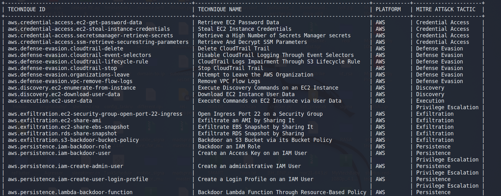
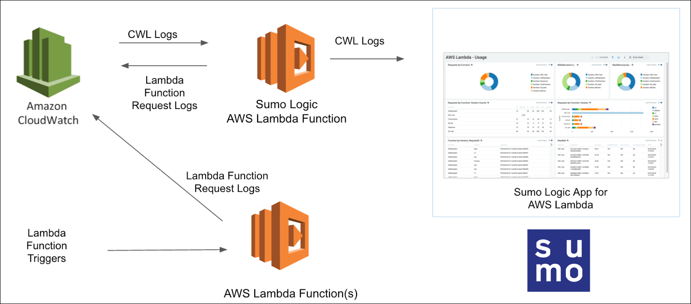

### AWS Threat Detection with Stratus Red Team

This repository is a documentation of my adventures with [Stratus Red Team](https://github.com/DataDog/stratus-red-team) 

Stratus Red Team is "[Atomic Red Team](https://github.com/redcanaryco/atomic-red-team) for the cloud, allowing to emulate offensive attack techniques in a granular and self-contained manner.

We run the attacks covered in the Stratus Red Team repository one by one on our AWS account. In order to monitor them, we will use CloudTrail and CloudWatch for logging and ingest these logs into [SumoLogic](https://www.sumologic.com/) for further analysis.

| Attack                                                     	| Description                                            	|                              Link                              	|
|------------------------------------------------------------	|--------------------------------------------------------	|:--------------------------------------------------------------:	|
| aws.credential-access.ec2-get-password-data                	| Retrieve EC2 Password Data                             	|         [Link](aws.credential-access.ec2-get-password-data.md)        	|
| aws.credential-access.ec2-steal-instance-credentials       	| Steal EC2 Instance Credentials                         	|    [Link](aws.credential-access.ec2-steal-instance-credentials.md)    	|
| aws.credential-access.secretsmanager-retrieve-secrets      	| Retrieve a High Number of Secrets Manager secrets      	|    [Link](aws.credential-access.secretsmanager-retrieve-secrets.md)   	|
| aws.credential-access.ssm-retrieve-securestring-parameters 	| Retrieve And Decrypt SSM Parameters                    	| [Link](aws.credential-access.ssm-retrieve-securestring-parameters.md) 	|
| aws.defense-evasion.cloudtrail-delete                      	| Delete CloudTrail Trail                                	|            [Link](aws.defense-evasion.cloudtrail-delete.md)           	|
| aws.defense-evasion.cloudtrail-event-selectors             	| Disable CloudTrail Logging Through Event Selectors     	|       [Link](aws.defense-evasion.cloudtrail-event-selectors.md)       	|
| aws.defense-evasion.cloudtrail-lifecycle-rule              	| CloudTrail Logs Impairment Through S3 Lifecycle Rule   	|        [Link](aws.defense-evasion.cloudtrail-lifecycle-rule.md)       	|
| aws.defense-evasion.cloudtrail-stop                        	| Stop CloudTrail Trail                                  	|             [Link](aws.defense-evasion.cloudtrail-stop.md)            	|
| aws.defense-evasion.organizations-leave                    	| Attempt to Leave the AWS Organization                  	|           [Link](aws.defense-evasion.organizations-leave.md)          	|
| aws.defense-evasion.vpc-remove-flow-logs                   	| Remove VPC Flow Logs                                   	|          [Link](aws.defense-evasion.vpc-remove-flow-logs.md)          	|
| aws.discovery.ec2-enumerate-from-instance                  	| Execute Discovery Commands on an EC2 Instance          	|          [Link](aws.discovery.ec2-enumerate-from-instance.md)         	|
| aws.discovery.ec2-download-user-data                       	| Download EC2 Instance User Data                        	|                               TBD                              	|
| aws.execution.ec2-user-data                                	| Execute Commands on EC2 Instance via User Data         	|                               TBD                              	|
| aws.exfiltration.ec2-security-group-open-port-22-ingress   	| Open Ingress Port 22 on a Security Group               	|                               TBD                              	|
| aws.exfiltration.ec2-share-ami                             	| Exfiltrate an AMI by Sharing It                        	|                               TBD                              	|
| aws.exfiltration.ec2-share-ebs-snapshot                    	| Exfiltrate EBS Snapshot by Sharing It                  	|                               TBD                              	|
| aws.exfiltration.rds-share-snapshot                        	| Exfiltrate RDS Snapshot by Sharing                     	|                               TBD                              	|
| aws.exfiltration.s3-backdoor-bucket-policy                 	| Backdoor an S3 Bucket via its Bucket Policy            	|                               TBD                              	|
| aws.persistence.iam-backdoor-role                          	| Backdoor an IAM Role                                   	|                               TBD                              	|
| aws.persistence.iam-backdoor-user                          	| Create an Access Key on an IAM User                    	|                               TBD                              	|
| aws.persistence.iam-create-admin-user                      	| Create an administrative IAM User                      	|                               TBD                              	|
| aws.persistence.iam-create-user-login-profile              	| Create a Login Profile on an IAM User                  	|                               TBD                              	|
| aws.persistence.lambda-backdoor-function                   	| Backdoor Lambda Function Through Resource-Based Policy 	|                               TBD                              	|

#### Credits
1.  Awesome team at Datadog, Inc. for Stratus Red Team [here](https://github.com/DataDog/stratus-red-team)
2.  Hacking the Cloud [AWS](https://hackingthe.cloud/aws/general-knowledge/assume_role_logic/)
3.  Falcon Force team [blog](https://medium.com/falconforce/falconfriday-detecting-realistic-aws-cloud-attacks-using-azure-sentinel-0xff1c-b62fd45c87dc)