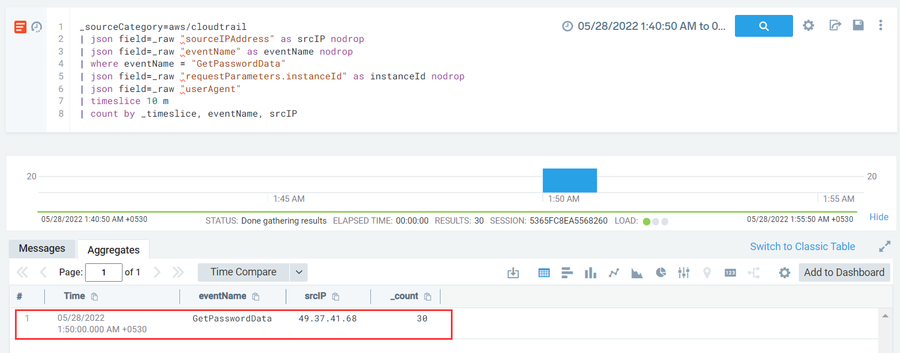

#### Description

 This attack simulates an entity assuming an IAM role that does not have permission to run ec2:GetPasswordData. *GetPasswordData* is used to retrieve the encrypted administrator password for a running Windows instance. And using the role it runs the ec2:GetPasswordData calls (failed) using random instance IDs.

#### Run the test

```
└─$ ./stratus detonate aws.credential-access.ec2-get-password-data
2022/05/27 16:19:46 Checking your authentication against AWS
2022/05/27 16:19:47 Not warming up - aws.credential-access.ec2-get-password-data is already warm. Use --force to force
2022/05/27 16:19:47 Running ec2:GetPasswordData on 30 random instance IDs
```

#### Detection 

In this case, for detection we should be looking for a large number of requests made for ec2:GetPasswordData API call in a short time interval

```
_sourceCategory=aws/cloudtrail
| json field=_raw "sourceIPAddress" as srcIP nodrop
| json field=_raw "eventName" as eventName nodrop 
| where eventName = "GetPasswordData"
| json field=_raw "requestParameters.instanceId" as instanceId nodrop
| json field=_raw "userAgent"
| timeslice 10 m
| count by _timeslice, eventName, srcIP
```



*Note*: In case that the API call is sprayed using rotated IPs, we can fine tune the rule to exclude *scrIP* and create an agrregation of *GetPasswordData* API call over signficant slices of time and look for outliers.