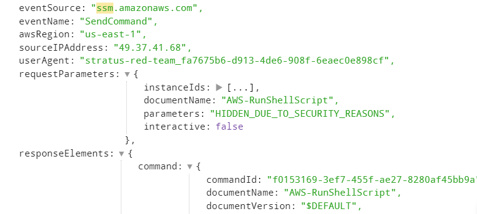
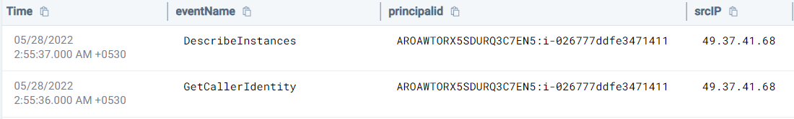
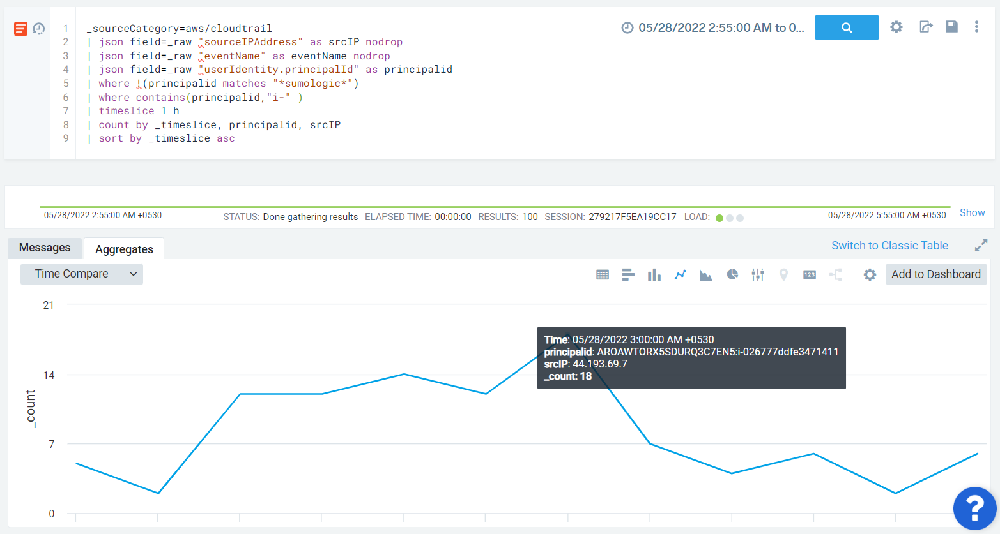
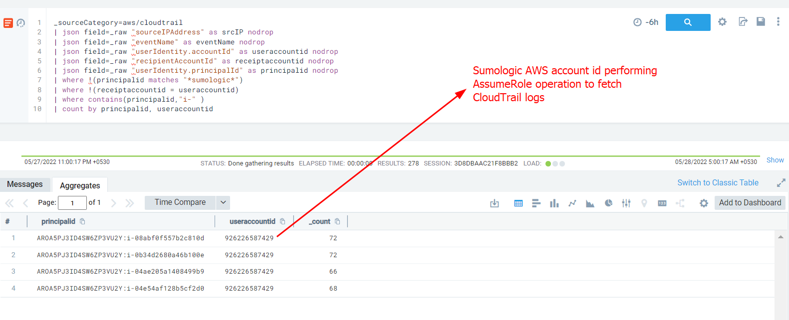

#### Description

This attack simulates theft of EC2 instance credentials from the Instance Metadata Service. An SSM command will be used to grab temporary access credentials from the metadata service of an ec2 instance 

`curl 169.254.169.254/latest/meta-data/iam/security-credentials/stratus-ec2-credentials-instance-role/`

Next, the AWS credentials would be used by the attacker to make API calls - either from the attacker machine or from an ec2 instance spawned in the attacker's AWS account. While creating a detection rule we need to keep both situations in mind and hence cannot solely rely on IP addresses internal/external to AWS.

### Running the test
```
└─$ ./stratus detonate aws.credential-access.ec2-steal-instance-credentials
2022/05/27 17:24:45 Checking your authentication against AWS
2022/05/27 17:24:47 Not warming up - aws.credential-access.ec2-steal-instance-credentials is already warm. Use --force to force
2022/05/27 17:24:47 Waiting for instance i-026777ddfe3471411 to show up in AWS SSM
2022/05/27 17:24:56 Instance i-026777ddfe3471411 is ready to go in SSM
2022/05/27 17:24:56 Running command through SSM on i-026777ddfe3471411: curl 169.254.169.254/latest/meta-data/iam/security-credentials/stratus-ec2-credentials-instance-role/
2022/05/27 17:25:03 Successfully stole temporary instance credentials from the instance metadata service
2022/05/27 17:25:03 sts:GetCallerIdentity returned arn:aws:sts::<redacted>:assumed-role/stratus-ec2-credentials-instance-role/i-026777ddfe3471411
2022/05/27 17:25:03 Locally running a benign API call ec2:DescribeInstances using stolen credentials
```

#### Detection 

In terms of the SSM command invocation mainly three API calls are used:
- DescribeInstanceInformation: Describes one or more of instances, including OS, version of SSM Agent etc
- SendCommand: Runs commands on one or more managed instances.
- GetCommandInvocation: Returns detailed information about command execution for an invocation.

If we look into the *SendCommand* event we see that although the document name is visible the request parameters are not logged due to security reasons.



Due to these limitations, we will not base our detection on the SSM command invocation. Additionally there can be other ways to steal the access credentials for example via SSRF. 

In order to identify API calls made using stolen instance credentials we need to look into the **userIdentity.principalId** field. They would contain the string "*i-{instanceid}*" 



As described in the test we can see the following two events. 

In terms of detection, best practice would be to maintain a whitelist of commonly used instance id credentials vs IP address or create a similar baseline and lookout for new IP addresses using ec2 credentials.

```
_sourceCategory=aws/cloudtrail 
| json field=_raw "sourceIPAddress" as srcIP nodrop
| json field=_raw "eventName" as eventName nodrop 
| json field=_raw "userIdentity.principalId" as principalid
| where !(principalid matches "*sumologic*")
| where contains(principalid,"i-" )
| timeslice 1 h
| count by _timeslice, principalid, srcIP
| sort by _timeslice asc
```



Aditionally, if an attacker uses the credentials from an ec2 instance on the attacker's AWS account (aws internal IP address). We can alert on all API calls made using ec2 credentials used from an external account (with different accountid) by utilising *recipientAccountId* and *userIdentity.accountId* fields.

```
_sourceCategory=aws/cloudtrail 
| json field=_raw "sourceIPAddress" as srcIP nodrop
| json field=_raw "eventName" as eventName nodrop 
| json field=_raw "userIdentity.accountId" as useraccountid nodrop
| json field=_raw "recipientAccountId" as receiptaccountid nodrop
| json field=_raw "userIdentity.principalId" as principalid nodrop
| where !(principalid matches "*sumologic*")
| where !(receiptaccountid = useraccountid)
| where contains(principalid,"i-" )
| count by principalid, useraccountid
```

