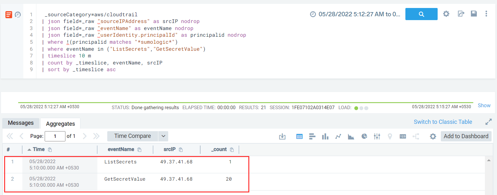

#### Description

 This attack simulates retrieval of a high number of Secrets Manager secrets by using secretsmanager:GetSecretValue API call. It involves a call to ListSecrets and then enumeration of each secret one by one.
 
#### Run the test

```
2022/05/27 19:43:38 Checking your authentication against AWS
2022/05/27 19:43:39 Not warming up - aws.credential-access.secretsmanager-retrieve-secrets is already warm. Use --force to force
2022/05/27 19:43:40 Retrieving value of secret arn:aws:secretsmanager:us-east-1:redacted:secret:stratus-red-team-secret-13-Ehayw0
2022/05/27 19:43:41 Retrieving value of secret arn:aws:secretsmanager:us-east-1:redacted:secret:stratus-red-team-secret-19-y7Tm1V
2022/05/27 19:43:41 Retrieving value of secret arn:aws:secretsmanager:us-east-1:redacted:secret:stratus-red-team-secret-17-75I4FS
2022/05/27 19:43:41 Retrieving value of secret arn:aws:secretsmanager:us-east-1:redacted:secret:stratus-red-team-secret-5-ofUuIZ
2022/05/27 19:43:42 Retrieving value of secret arn:aws:secretsmanager:us-east-1:redacted:secret:stratus-red-team-secret-1-q1jFuR
2022/05/27 19:43:42 Retrieving value of secret arn:aws:secretsmanager:us-east-1:redacted:secret:stratus-red-team-secret-15-N1a8BR
2022/05/27 19:43:42 Retrieving value of secret arn:aws:secretsmanager:us-east-1:redacted:secret:stratus-red-team-secret-2-AfRHfY
2022/05/27 19:43:42 Retrieving value of secret arn:aws:secretsmanager:us-east-1:redacted:secret:stratus-red-team-secret-8-0KvxWK
2022/05/27 19:43:43 Retrieving value of secret arn:aws:secretsmanager:us-east-1:redacted:secret:stratus-red-team-secret-6-ZZ7maQ
2022/05/27 19:43:43 Retrieving value of secret arn:aws:secretsmanager:us-east-1:redacted:secret:stratus-red-team-secret-14-aZ3AHP
2022/05/27 19:43:43 Retrieving value of secret arn:aws:secretsmanager:us-east-1:redacted:secret:stratus-red-team-secret-0-fT1KZE
2022/05/27 19:43:43 Retrieving value of secret arn:aws:secretsmanager:us-east-1:redacted:secret:stratus-red-team-secret-12-aHMBuz
2022/05/27 19:43:44 Retrieving value of secret arn:aws:secretsmanager:us-east-1:redacted:secret:stratus-red-team-secret-10-5vIXqr
2022/05/27 19:43:44 Retrieving value of secret arn:aws:secretsmanager:us-east-1:redacted:secret:stratus-red-team-secret-3-oriygq
2022/05/27 19:43:44 Retrieving value of secret arn:aws:secretsmanager:us-east-1:redacted:secret:stratus-red-team-secret-11-CcDZCi
2022/05/27 19:43:44 Retrieving value of secret arn:aws:secretsmanager:us-east-1:redacted:secret:stratus-red-team-secret-18-l0pzAc
2022/05/27 19:43:45 Retrieving value of secret arn:aws:secretsmanager:us-east-1:redacted:secret:stratus-red-team-secret-7-x8k8lg
2022/05/27 19:43:45 Retrieving value of secret arn:aws:secretsmanager:us-east-1:redacted:secret:stratus-red-team-secret-16-668PZg
2022/05/27 19:43:45 Retrieving value of secret arn:aws:secretsmanager:us-east-1:redacted:secret:stratus-red-team-secret-4-M2CSVe
2022/05/27 19:43:45 Retrieving value of secret arn:aws:secretsmanager:us-east-1:redacted:secret:stratus-red-team-secret-9-kRrek9
```
 
#### Detection 

In this case, for detection we should be looking for a call to ListSecrets followed by a large number of requests made for secretsmanager:GetSecretValue in a short time interval from an external IP address.

 ```
 _sourceCategory=aws/cloudtrail
| json field=_raw "sourceIPAddress" as srcIP nodrop
| json field=_raw "eventName" as eventName nodrop 
| json field=_raw "userIdentity.principalId" as principalid nodrop
| where !(principalid matches "*sumologic*")
| where eventName in ("ListSecrets","GetSecretValue")
| timeslice 10 m
| count by _timeslice, srcIP
| sort by _timeslice asc
 ```
 
