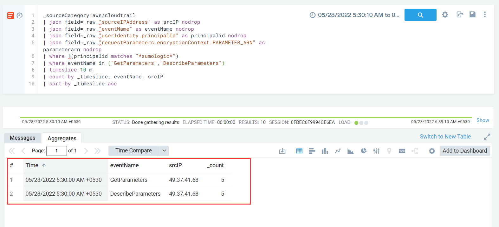
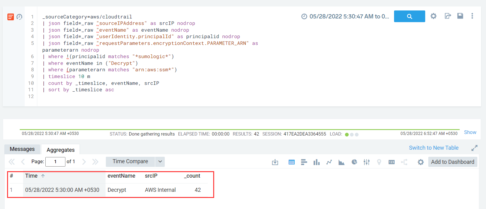

#### Description

 This attack simulates retrieval and decryption of a high number (42) of SSM Parameters available in an AWS region. It involves using the ssm:DescribeParameters API call to list all SSM parameters and then using ssm:GetParameters to retrieve their individual values in batches of 10 (maximum supported value)
 
#### Run the test

```
└─$ ./stratus detonate aws.credential-access.ssm-retrieve-securestring-parameters
2022/05/27 20:05:19 Checking your authentication against AWS
2022/05/27 20:05:20 Not warming up - aws.credential-access.ssm-retrieve-securestring-parameters is already warm. Use --force to force
2022/05/27 20:05:20 Running ssm:DescribeParameters and ssm:GetParameters by batch of 10 to find all SSM Parameters in the current region
2022/05/27 20:05:22 Successfully retrieved 10 SSM Parameters
2022/05/27 20:05:22 Successfully retrieved 10 SSM Parameters
2022/05/27 20:05:23 Successfully retrieved 10 SSM Parameters
2022/05/27 20:05:24 Successfully retrieved 10 SSM Parameters
2022/05/27 20:05:24 Successfully retrieved 2 SSM Parameters
```

#### Detection 
In this case, for detection we may look for a calls to ssm:DescribeParameters followed by a large number of requests made for ssm:GetParameters in batches from 
an external IP address. In this case to retrieve 42 such parameters, 5 such calls were required (4\*10 +2)



Apparently instead of using the above two API calls since no of calls will be low (due to requests in batch) we know that GetParameter will ultimately 
call `kms:Decrypt` hence, we can focus detection solely on the individual Decrypt API calls


In order to restrict the rule to only *securestring parameters* we will filter for results where **requestParameters.encryptionContext.PARAMETER_ARN** starts with arn:aws:ssm and we should be getting 42 *kms:Decrypt* API calls
 


Since in this case the source IP is Internal, an interesting idea would be to create a baseline for no of Decrypt API calls over a specific interval and look for outliers.