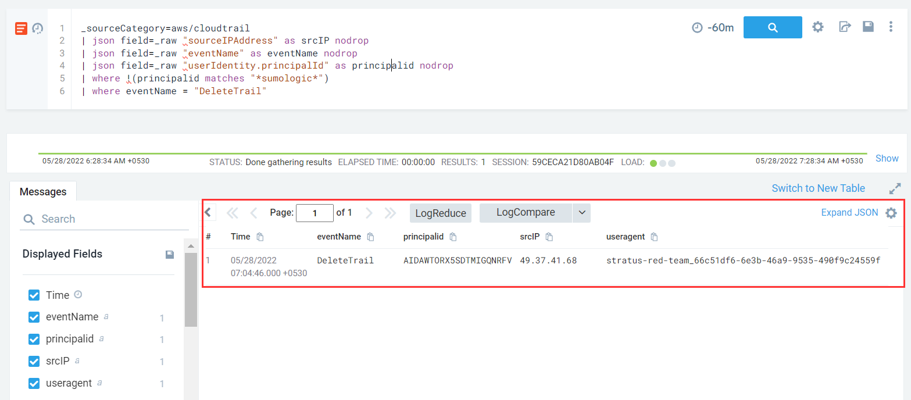

#### Description
This attack simulates an attacker disrupting CloudTrail logging.

#### Run the test

```
└─$ ./stratus detonate aws.defense-evasion.cloudtrail-delete
2022/05/27 21:34:12 Checking your authentication against AWS
2022/05/27 21:34:13 Not warming up - aws.defense-evasion.cloudtrail-delete is already warm. Use --force to force
2022/05/27 21:34:13 Deleting CloudTrail trail my-cloudtrail-trail-2
```

#### Detection 

This has a pretty much straight forward detection rule - alert on **DeleteTrail** API call.

```
_sourceCategory=aws/cloudtrail
| json field=_raw "sourceIPAddress" as srcIP nodrop
| json field=_raw "eventName" as eventName nodrop 
| json field=_raw "userIdentity.principalId" as principalid nodrop
| where !(principalid matches "*sumologic*")
| where eventName = "DeleteTrail"
```

