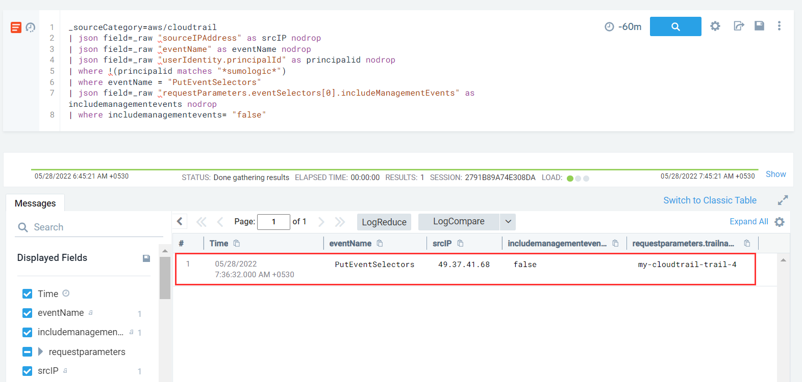

#### Description

This attack simulates an attacker disrupting CloudTrail Logging by creating an event selector on the Trail, excluding out all management events.

#### Run the test

```
└─$ ./stratus detonate aws.defense-evasion.cloudtrail-event-selectors 
2023/01/06 13:58:42 Checking your authentication against AWS
2023/01/06 13:58:44 Not warming up - aws.defense-evasion.cloudtrail-event-selectors is already warm. Use --force to force
2023/01/06 13:58:44 Applying event selector on CloudTrail trail stratus-red-team-ctes-trail-vxwwrlzvwl to disable logging management and data events
```

#### Detection 

When it comes to detection, we will track the usage of a particular API call **PutEventSelectors** which is used when we apply event selectors to enable/disable logging of particular events on a existing Cloud Trail.

Inorder to check whether management event logging is being disabled we can use an additional filter on the PutEventSelector log which checks if *includeManagementEvents* entry is false.

```
_sourceCategory=aws/cloudtrail
| json field=_raw "sourceIPAddress" as srcIP nodrop
| json field=_raw "eventName" as eventName nodrop 
| json field=_raw "userIdentity.principalId" as principalid nodrop
| where !(principalid matches "*sumologic*")
| where eventName = "PutEventSelectors"
| json field=_raw "requestParameters.eventSelectors[0].includeManagementEvents" as includemanagementevents nodrop
| where includemanagementevents= "false"
```



