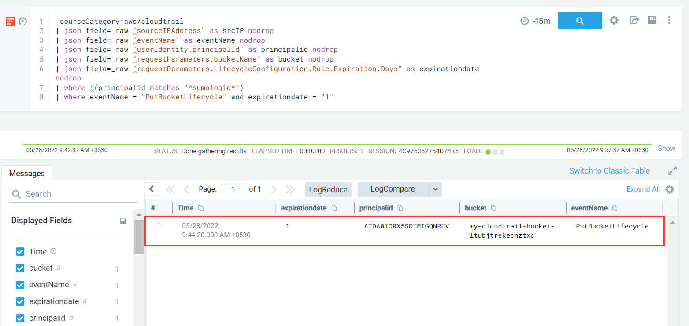

#### Description

This attack simulates an attacker disrupting CloudTrail Logging by using a S3 Lifecycle Rule thereby setting up a 1 day retention policy on the s3 bucket in which the logs are being stored.

#### Run the test

```
└─$ ./stratus detonate aws.defense-evasion.cloudtrail-lifecycle-rule
2022/05/28 00:13:45 Checking your authentication against AWS
2022/05/28 00:13:46 Not warming up - aws.defense-evasion.cloudtrail-lifecycle-rule is already warm. Use --force to force
2022/05/28 00:13:46 Setting a short retention policy on CloudTrail S3 bucket my-cloudtrail-bucket-ltubjtrekechztxc
```

#### Detection 

To detect this, we will specifically look for **PutBucketLifecycle** event with attribute *requestParameters.LifecycleConfiguration.Rule.Expiration.Days* equal to 1 day.

```
_sourceCategory=aws/cloudtrail
| json field=_raw "sourceIPAddress" as srcIP nodrop
| json field=_raw "eventName" as eventName nodrop 
| json field=_raw "userIdentity.principalId" as principalid nodrop
| json field=_raw "requestParameters.bucketName" as bucket nodrop
| json field=_raw "requestParameters.LifecycleConfiguration.Rule.Expiration.Days" as expirationday nodrop
| where !(principalid matches "*sumologic*")
| where eventName = "PutBucketLifecycle" and expirationday = "1"
```



