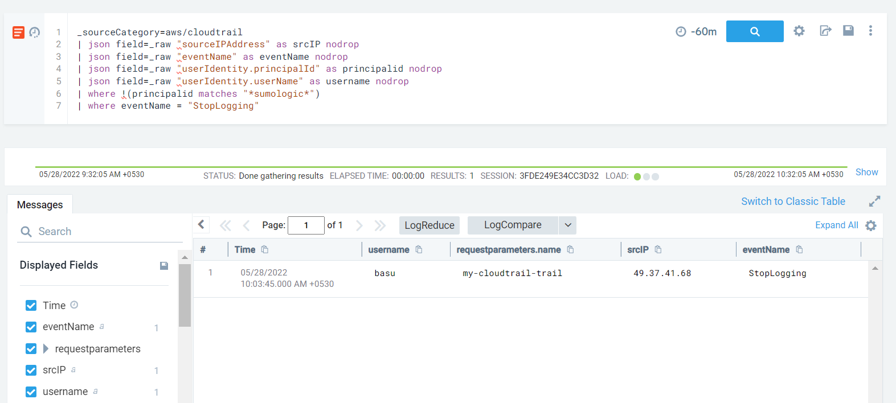

#### Description

This attack simulates an attacker disrupting CloudTrail Logging by explicitly specifying *Stop Logging* to cease cloud trail logging.

#### Run the test

```
└─$ ./stratus detonate aws.defense-evasion.cloudtrail-stop
2022/05/28 00:33:10 Checking your authentication against AWS
2022/05/28 00:33:11 Not warming up - aws.defense-evasion.cloudtrail-stop is already warm. Use --force to force
2022/05/28 00:33:11 Stopping CloudTrail trail my-cloudtrail-trail
```

#### Detection 

This has a pretty much straight forward detection rule - alert on **StopLogging** API call.

```
_sourceCategory=aws/cloudtrail
| json field=_raw "sourceIPAddress" as srcIP nodrop
| json field=_raw "eventName" as eventName nodrop 
| json field=_raw "userIdentity.principalId" as principalid nodrop
| json field=_raw "userIdentity.userName" as username nodrop
| where !(principalid matches "*sumologic*")
| where eventName = "StopLogging"
```

