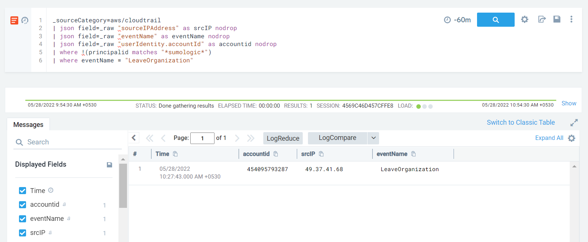

#### Description

This attack simulates an insider's unsuccessful attempt to leave the AWS Organization. Leaving the organization may disrupt configurations and controls defined at the organization level - GuardDuty, SecurityHub, CloudTrail etc

#### Run the test

```
└─$ ./stratus detonate aws.defense-evasion.organizations-leave
2022/05/28 00:57:07 Checking your authentication against AWS
2022/05/28 00:57:08 Not warming up - aws.defense-evasion.organizations-leave is already warm. Use --force to force
2022/05/28 00:57:08 Attempting to leave the AWS organization (will trigger an Access Denied error)
2022/05/28 00:57:10 Got an access denied error as expected
```

#### Detection 

A straightforward detection - look for *LeaveOrganization* API call.

```
_sourceCategory=aws/cloudtrail
| json field=_raw "sourceIPAddress" as srcIP nodrop
| json field=_raw "eventName" as eventName nodrop
| json field=_raw "userIdentity.accountId" as accountid nodrop
| where !(principalid matches "*sumologic*")
| where eventName = "LeaveOrganization"
```


