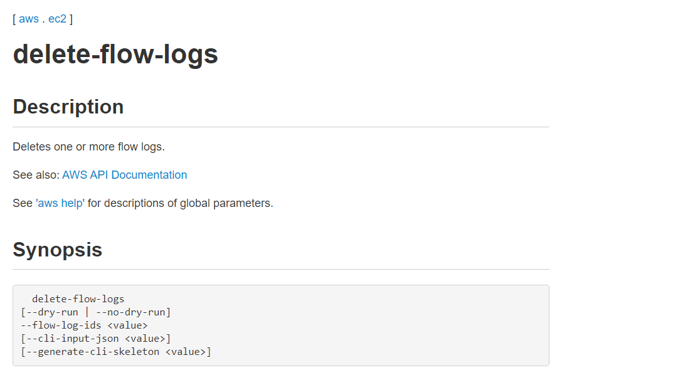
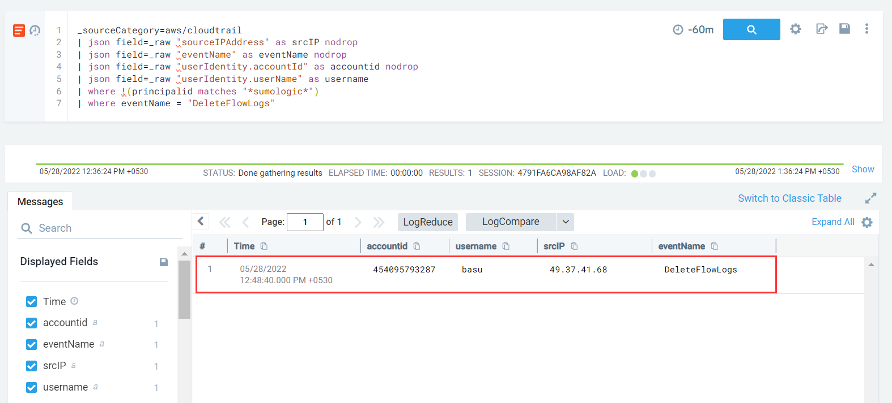

#### Description

This attack simulates an attacker disabling a VPC Flow Logs configuration.

#### Run the test

```
└─$ ./stratus detonate aws.defense-evasion.vpc-remove-flow-logs
2022/05/28 03:18:05 Checking your authentication against AWS
2022/05/28 03:18:07 Not warming up - aws.defense-evasion.vpc-remove-flow-logs is already warm. Use --force to force
2022/05/28 03:18:07 Removing VPC Flow Logs fl-0399d4d46d2415ccf in VPC vpc-0e8d434f9ef859b46
```

#### Detection 

According to AWS docs in order to remove vpc flow logs via CLI we use



To detect this event we need to monitor for a single API call - **DeleteFlowLogs** 

```
_sourceCategory=aws/cloudtrail
| json field=_raw "sourceIPAddress" as srcIP nodrop
| json field=_raw "eventName" as eventName nodrop
| json field=_raw "userIdentity.accountId" as accountid nodrop
| json field=_raw "userIdentity.userName" as username
| where eventName = "DeleteFlowLogs"
```

