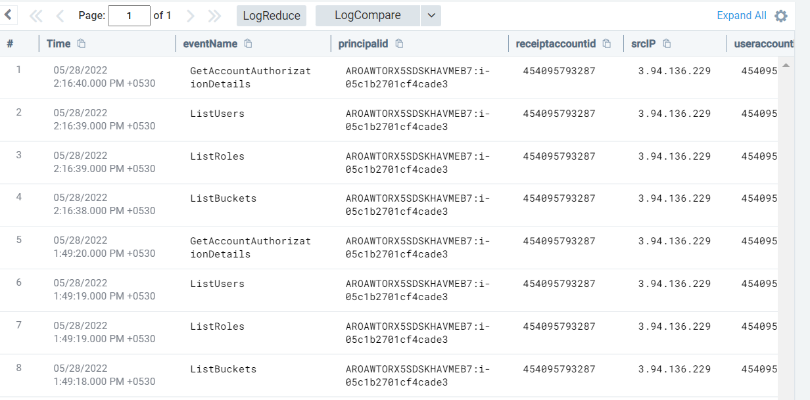

#### Description

This attack simulates an attacker running AWS discovery commands from an ec2 instance utilising the ec2 instance role. 

#### Run the test

```
└─$ ./stratus detonate aws.discovery.ec2-enumerate-from-instance
2022/05/28 04:18:35 Checking your authentication against AWS
2022/05/28 04:18:36 Not warming up - aws.discovery.ec2-enumerate-from-instance is already warm. Use --force to force
2022/05/28 04:18:36 Running commands through SSM on i-05c1b2701cf4cade3:
  - aws sts get-caller-identity || true
  - aws s3 ls || true
  - aws iam get-account-summary || true
  - aws iam list-roles || true
  - aws iam list-users || true
  - aws iam get-account-authorization-details >/dev/null || true
  - aws ec2 describe-snapshots || true
  - aws cloudtrail describe-trails || true
  - aws guardduty list-detectors || true
```

#### Detection 

Since commands are being run under the identity of the ec2 instance role as discussed previously, all logs associated with those discovery API calls would contain the string  "*i-{instanceid}*" in the *userIdentity.principalId* field.

Aditionally we can monitor for these discovery events - ListBuckets, ListRoles, ListUsers, GetAccountAuthorizationDetails etc which are uncommon to be run from an ec2 instance role.

In this case since ec2 credentials are being used from inside the ec2 instance *recipientAccountId* and *useraccountid* values would be the same.

```
_sourceCategory=aws/cloudtrail 
| json field=_raw "sourceIPAddress" as srcIP nodrop
| json field=_raw "eventName" as eventName nodrop 
| json field=_raw "userIdentity.principalId" as principalid
| json field=_raw "recipientAccountId" as receiptaccountid 
| json field=_raw "userIdentity.accountId" as useraccountid
| where !(principalid matches "*sumologic*")
| where receiptaccountid = useraccountid
| where contains(principalid,"i-" )
| where eventName in ("ListBuckets", "ListRoles", "ListUsers", "GetAccountAuthorizationDetails")
```

