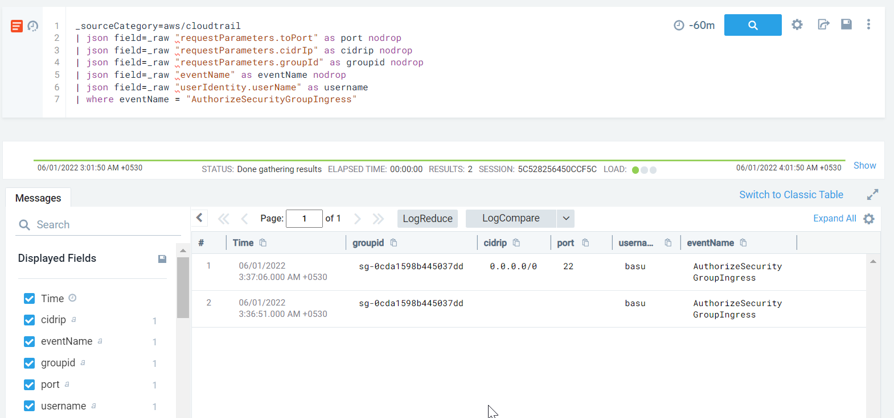

#### Description

This attack simulates an attacker allowing ingress traffic to port 22 from the Internet on a particular security group in an attempt to connect and exfiltrate data.

#### Run the test
```
└─$ ./stratus detonate aws.exfiltration.ec2-security-group-open-port-22-ingress
2022/05/31 18:06:25 Checking your authentication against AWS
2022/05/31 18:06:26 Not warming up - aws.exfiltration.ec2-security-group-open-port-22-ingress is already warm. Use --force to force
2022/05/31 18:06:26 Opening port 22 from the Internet on sg-0cda1598b445037dd
```

#### Detection 

The API call associated with the action is *ec2:AuthorizeSecurityGroupIngress* 

Additionally the *requestparameters.toport* denotes the port being opened and  *requestparameters.cidrip* denotes the CIDR range to which is allowed to access the newly opened port

```
_sourceCategory=aws/cloudtrail
| json field=_raw "requestParameters.toPort" as port nodrop
| json field=_raw "requestParameters.cidrIp" as cidrip nodrop
| json field=_raw "requestParameters.groupId" as groupid nodrop
| json field=_raw "eventName" as eventName nodrop
| json field=_raw "userIdentity.userName" as username
| where eventName = "AuthorizeSecurityGroupIngress"
```



Since this API call may have legitimate use cases, there maybe a high no of false positives. Best practice would be to create a baseline as to which security groups allow inbound traffic from the Internet on selected ports and look for outliers.

Let's assume that in our case only one security group with id : 
*sg-aaac52d02d5e4d843* allows inbound traffic from the Internet on port 22 in that cause we can craft queries like these


```
_sourceCategory=aws/cloudtrail
| json field=_raw "requestParameters.toPort" as port nodrop
| json field=_raw "requestParameters.cidrIp" as cidrip nodrop
| json field=_raw "requestParameters.groupId" as groupid nodrop
| json field=_raw "eventName" as eventName nodrop
| json field=_raw "userIdentity.userName" as username
| where eventName = "AuthorizeSecurityGroupIngress"
| where !(groupid in ("sg-aaac52d02d5e4d843"))
```

