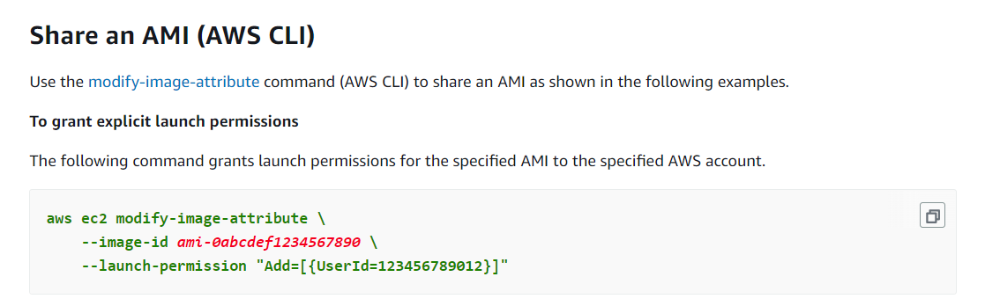
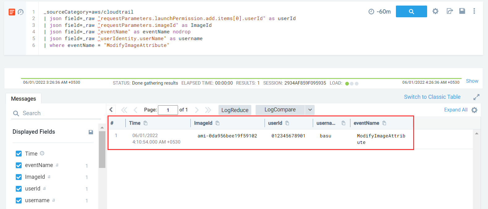

#### Description

This simulates an attacker exfiltrating a private AMI by sharing it with an external AWS account.

#### Run the test
```
2022/05/31 18:40:12 Checking your authentication against AWS
2022/05/31 18:40:13 Not warming up - aws.exfiltration.ec2-share-ami is already warm. Use --force to force
2022/05/31 18:40:13 Exfiltrating AMI ami-0da956bee19f59102 by sharing it with an external AWS account
```

### Detection

Sharing a private AMI with an external AWS account for legitimate business purposes via AWS CLI is done (acc to Amazon docs) in this way. 



The corresponding API call is *ModifyImageAttribute* and we need to look out for the *UserID* parameter in the *Launch-Permission* attribute which denotes the account id with which the snapshot is being shared.

```
_sourceCategory=aws/cloudtrail
| json field=_raw "requestParameters.launchPermission.add.items[0].userId" as userId
| json field=_raw "requestParameters.imageId" as ImageId
| json field=_raw "eventName" as eventName nodrop
| json field=_raw "userIdentity.userName" as username
| where eventName = "ModifyImageAttribute"
```



In case the AMI is made public, the `item` entry would be `{"groups":"all"}`.

Best practice would be to maintain a list of trusted AWS accounts to which AMI's are regularly shared and alert incase sharing takes place with a rogue account.

