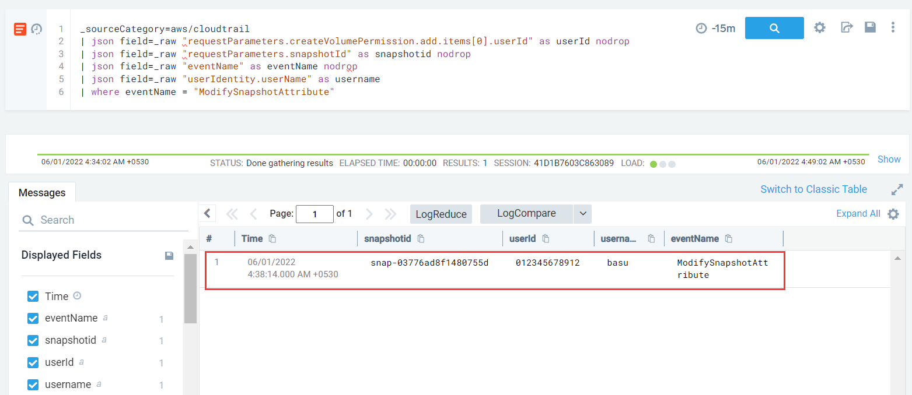

#### Description

This simulates an attacker exfiltrating a private EBS snapshot by sharing it with an external AWS account.


#### Run the test

```
└─$ ./stratus detonate aws.exfiltration.ec2-share-ebs-snapshot
2022/05/31 19:07:31 Checking your authentication against AWS
2022/05/31 19:07:32 Not warming up - aws.exfiltration.ec2-share-ebs-snapshot is already warm. Use --force to force
2022/05/31 19:07:32 Sharing the volume snapshot snap-03776ad8f1480755d with an external AWS account...
```

#### Detection

Similar to sharing AMI's, sharing an EBS snapshot results in a *ModifySnapshotAttribute* event.

The fields of interest in this log entry are *requestParameters.snapshotId* which denotes the ID of the snapshot being shared and *requestParameters.createVolumePermission.add.items[0].userId* which denotes the account id with which the snapshot is being shared.

```
_sourceCategory=aws/cloudtrail
| json field=_raw "requestParameters.createVolumePermission.add.items[0].userId" as userId nodrop
| json field=_raw "requestParameters.snapshotId" as snapshotid nodrop
| json field=_raw "eventName" as eventName nodrop
| json field=_raw "userIdentity.userName" as username
| where eventName = "ModifySnapshotAttribute"
```



In case the AMI is made public, the `item` entry would be `{"groups":"all"}`.

Best practice would be to maintain a list of trusted AWS accounts to which AMI's are regularly shared and alert incase sharing takes place with a rogue account.