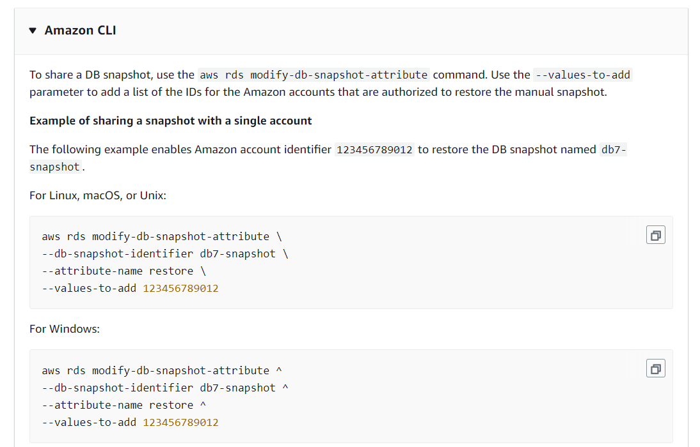
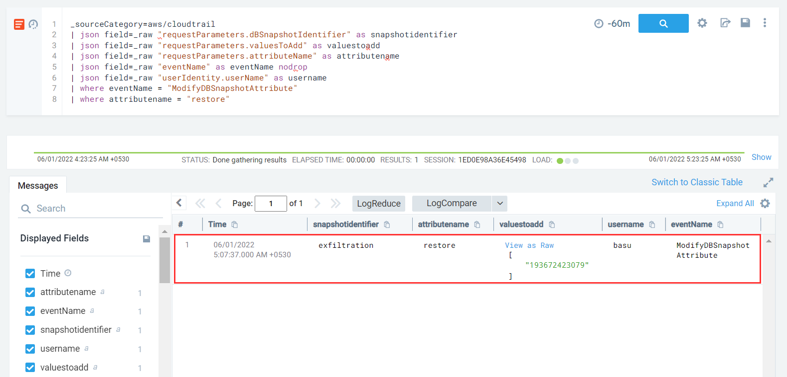

#### Description

This simulates an attacker exfiltrating a database by sharing a private RDS snapshot with an external AWS account.

#### Run the test

```
└─$ ./stratus detonate aws.exfiltration.rds-share-snapshot
2022/05/31 19:36:53 Checking your authentication against AWS
2022/05/31 19:36:55 Not warming up - aws.exfiltration.rds-share-snapshot is already warm. Use --force to force
2022/05/31 19:36:55 Sharing RDS Snapshot exfiltration with an external AWS account
```

#### Detection

Similar to sharing AMI's and EBS snapshots, sharing of RDS snapshots results in *ModifyDBSnapshotAttribute* event.

According to Amazon docs, sharing a snapshot using AWS CLI can be done in this way



Hence we should look for *ModifyDBSnapshotAttribute* events with *attributename* parameter equals *restore*

```
_sourceCategory=aws/cloudtrail
| json field=_raw "requestParameters.dBSnapshotIdentifier" as snapshotidentifier
| json field=_raw "requestParameters.valuesToAdd" as valuestoadd
| json field=_raw "requestParameters.attributeName" as attributename
| json field=_raw "eventName" as eventName nodrop
| json field=_raw "userIdentity.userName" as username
| where eventName = "ModifyDBSnapshotAttribute"
| where attributename = "restore"
```

