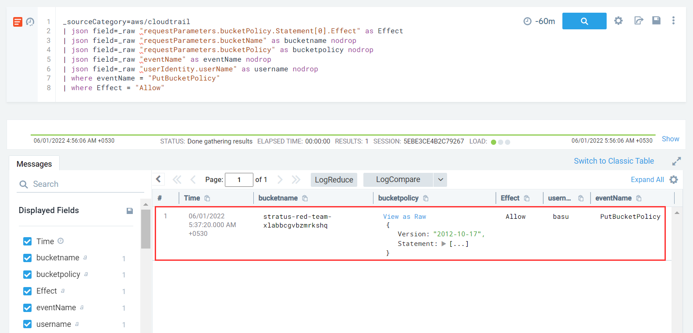

#### Description

This attack simulates an attacker allowing external account access to a S3 bucket by backdooring its policy document leading to data exfiltration.

#### Run the test

```
└─$ ./stratus detonate aws.exfiltration.s3-backdoor-bucket-policy
2022/05/31 20:06:35 Checking your authentication against AWS
2022/05/31 20:06:36 Not warming up - aws.exfiltration.s3-backdoor-bucket-policy is already warm. Use --force to force
2022/05/31 20:06:36 Backdooring bucket policy of stratus-red-team-xlabbcgvbzmrkshq
```

#### Detection

Initially on **warmup**, no bucket policy is attached to the created s3 bucket.

However on **detonation** of the tool, a new bucket policy is attached which allows a user from an external AWS account to perform s3 related actions on s3 resources in the victim AWS account

```
{
  "Version":"2012-10-17",
  "Statement":[
    {
      "Effect": "Allow",
      "Principal": {
        "AWS":"arn:aws:iam::193672423079:root"
      },
      "Action": [
        "s3:GetObject",
        "s3:GetBucketLocation",
        "s3:ListBucket"
      ],
      "Resource": [
        "arn:aws:s3:::%s/*",
        "arn:aws:s3:::%s"
      ]
    }
  ]
}
```

Addition/change of a bucket policy results in *PutBucketPolicy* event. Effect parameter can have two values - Allow and Deny but however since here external access is being granted the parameter would be set to **Allow**

```
_sourceCategory=aws/cloudtrail
| json field=_raw "requestParameters.bucketPolicy.Statement[0].Effect" as Effect
| json field=_raw "requestParameters.bucketName" as bucketname nodrop
| json field=_raw "requestParameters.bucketPolicy" as bucketpolicy nodrop
| json field=_raw "eventName" as eventName nodrop
| json field=_raw "userIdentity.userName" as username nodrop
| where eventName = "PutBucketPolicy"
| where Effect = "Allow"
```

