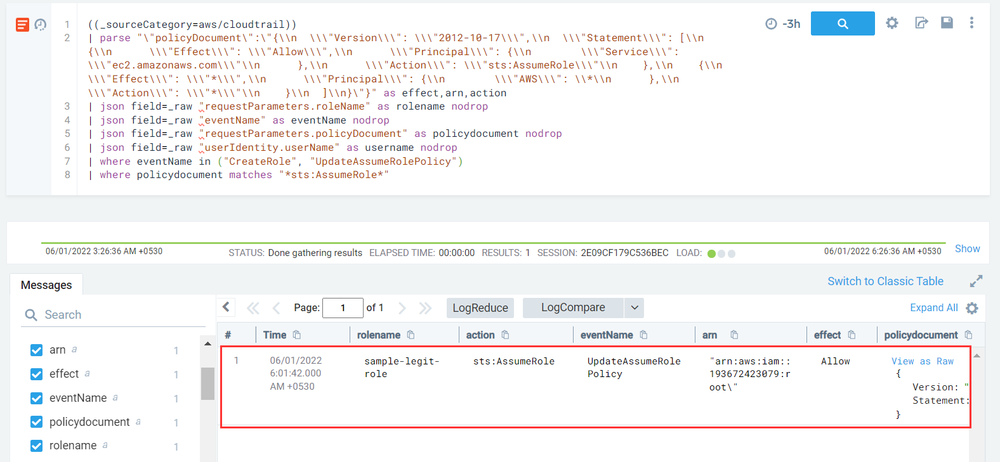

#### Description

This attack simulates an attacker backdooring an IAM role policy document with a malicious policy by allowing the role to be assumed from an external AWS account.

#### Run the test

```
/stratus detonate aws.persistence.iam-backdoor-role  
2022/05/31 20:30:56 Checking your authentication against AWS
2022/05/31 20:30:58 Not warming up - aws.persistence.iam-backdoor-role is already warm. Use --force to force
2022/05/31 20:30:58 Backdooring IAM role sample-legit-role by allowing sts:AssumeRole from an external AWS account
2022/05/31 20:30:59 Update role trust policy with malicious policy:
{
  "Version": "2012-10-17",
  "Statement": [
    {
      "Effect": "Allow",
      "Principal": {
        "Service": "ec2.amazonaws.com"
      },
      "Action": "sts:AssumeRole"
    },
    {
      "Effect": "Allow",
      "Principal": {
        "AWS": "arn:aws:iam::193672423079:root"
      },
      "Action": "sts:AssumeRole"
    }
  ]
}
```

#### Detection

This attack can happen via two routes - update existing role with malicious policy or creating a  new role hence our detection logic should include both events *CreateRole* and *UpdateAssumeRolePolicy* respectively.


```
((_sourceCategory=aws/cloudtrail))
| parse "\"policyDocument\":\"{\\n  \\\"Version\\\": \\\"2012-10-17\\\",\\n  \\\"Statement\\\": [\\n    {\\n      \\\"Effect\\\": \\\"Allow\\\",\\n      \\\"Principal\\\": {\\n        \\\"Service\\\": \\\"ec2.amazonaws.com\\\"\\n      },\\n      \\\"Action\\\": \\\"sts:AssumeRole\\\"\\n    },\\n    {\\n      \\\"Effect\\\": \\\"*\\\",\\n      \\\"Principal\\\": {\\n        \\\"AWS\\\": \\*\\n      },\\n      \\\"Action\\\": \\\"*\\\"\\n    }\\n  ]\\n}\"}" as effect,arn,action
| json field=_raw "requestParameters.roleName" as rolename nodrop
| json field=_raw "eventName" as eventName nodrop
| json field=_raw "requestParameters.policyDocument" as policydocument nodrop
| json field=_raw "userIdentity.userName" as username nodrop
| where eventName in ("CreateRole", "UpdateAssumeRolePolicy")
| where policydocument matches "*sts:AssumeRole*"
```



Individual fields from message parameter of the event logs can be sliced and parsed using Parse Operators in SumoLogic - [reference](https://help.sumologic.com/05Search/Search-Query-Language/01-Parse-Operators/01-Parse-Predictable-Patterns-Using-an-Anchor)


